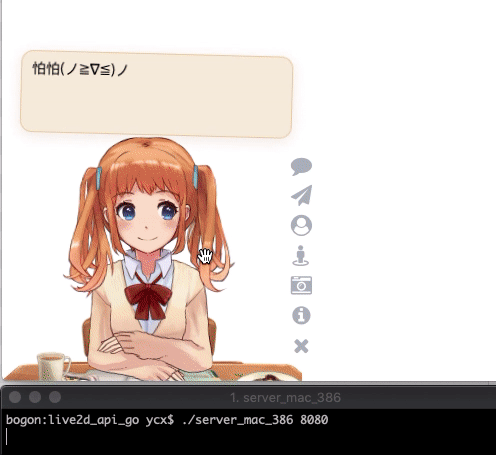

# live2d_api_go
Golang version of live2D 看板娘 api (https://github.com/fghrsh/live2d_api)

# Demo:



https://yangchenxi.github.io/live2d_api_go/

# Usage (Super Easy):

## HTTPS/TLS

If you are using letsencrypt, Please do the following to get the right cert to serve:

1. substitute `server.crt` to `/etc/letsencrypt/live/[name of your website]/cert.pem`

2. substitute `server.key` to `/etc/letsencrypt/live/[name of your website]/privkey.pem`

## Run:

**Great Thanks to Golang's powerful cross compiler!!**

```shell
git clone https://github.com/yangchenxi/live2d_api_go.git 

cd live2d_api_go 
```

### Linux 386:

http:
```shell
./server_linux_386 8080
```

https:
```shell
./server_linux_386 8080 https
```

### Mac 386:

http:
```shell
./server_mac_386 8080
```

https:
```shell
./server_mac_386 8080 https
```

### Windows 386:

http:
```shell
./server_win_386 8080
```

https:
```shell
./server_win_386 8080 https
```

**Note: 8080 above is the service port**


# Front-end:

https://github.com/stevenjoezhang/live2d-widget
